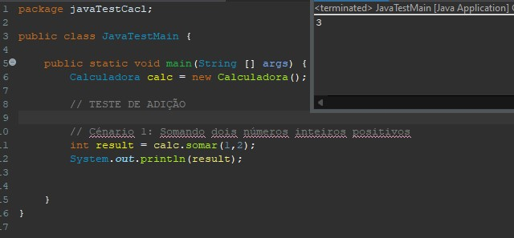

# Calculadora Java
## Descrição
O projeto foi desenvolvido em Java ( Ant ) , no qual é uma calculadora que tem a função : soma,susbtração ,divisão e multiplicação . Foi desenvolvido em cima de testes unitários

## Mecânicas

O projeto se baseia em fazer as operações básicas da matemática , onde irá se pode colocar dois valores , e depois terá um retorno do valor , que se resultou da operação escolhida

## Funcionalidades
Funcionalidades que estarão presentes na calculadora.

## Testes Unitário
O sistema ainda não possui testes automatizados, porém tem cénarios de testes criados 

### Adição
  - [x] - Somando dois números inteiros positivos
  - [x] - Somando um número positivo e outro negativo
  - [x] - Somando dois números inteiros negativos
  - [x] - Somando um número positivo com zero
  - [x] - Somando um número negativo com zero

### Subtração
  - [x] - Subtraindo dois números inteiros positivos
  - [x] - Subtraindo um número positivo e outro negativo
  - [x] - Subtraindo dois números inteiros negativos
  - [x] - Subtraindo dois números inteiros negativos
  - [x] - Subtraindo um número negativo com zero

### Multiplicação
  - [x] - Multiplicando dois números inteiros positivos
  - [x] - Muliplicando um número positivo e outro negativo
  - [x] - Multiplicando dois números inteiros negativos
  - [x] - Multiplicando um número positivo com zero

### Divisão
  - [x] - Dividindo dois números inteiros positivos
  - [x] - Dividindo um número positivo e outro negativo
  - [x] - Dividindo um número com zero -> Irá voltar um erro - O denominador n�o pode ser igual a zero.
  - [x] - Dividindo dois números inteiros negativos
  

## Última atualização 21/09/23
